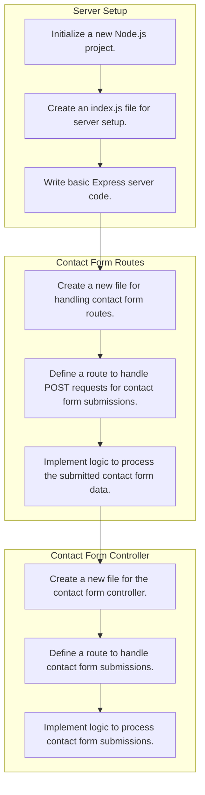

# KAIZEN Plan & DAG Execution Flow

## Overview
- **Deliverables Count**: 3
- **Tasks Count**: 9

## DAG Dependency Diagram

## Deliverables and Task Details

Deliverable: `Server Setup` (`server-f7565a`)
- Kind: `core_logic`
- Goal: Set up a basic Node.js Express server.
- Priority: `1`
- Deliverable Dependencies: `None`
- Tasks: 
1. **Initialize a new Node.js project.** (`server-f7565a-t1-51809c`)
- Output: `A package.json file is created in the project directory.`
- Completion Criteria: The developer can run 'npm init -y' and see a package.json file with default values.
- Task Dependencies: `None`
2. **Create an index.js file for server setup.** (`server-f7565a-t2-5e3dd5`)
- Output: `An index.js file is created in the project directory.`
- Completion Criteria: The developer can navigate to the directory and see an index.js file.
- Task Dependencies: `server-f7565a-t1-51809c`
3. **Write basic Express server code.** (`server-f7565a-t3-7e6a2a`)
- Output: `Basic Express server code is written in index.js.`
- Completion Criteria: The developer can run 'node index.js' and see a message indicating the server is running on port 3000.
- Task Dependencies: `server-f7565a-t2-5e3dd5`

Deliverable: `Contact Form Routes` (`routes-5c0f27`)
- Kind: `core_logic`
- Goal: Define routes for handling contact form submissions.
- Priority: `1`
- Deliverable Dependencies: `server-f7565a`
- Tasks: 
1. **Create a new file for handling contact form routes.** (`routes-5c0f27-t1-e0421b`)
- Output: `A new JavaScript file named `contactFormRoutes.js` in the `routes` directory.`
- Completion Criteria: The file should be created and located at `src/routes/contactFormRoutes.js`.
- Task Dependencies: `server-f7565a-t3-7e6a2a`
2. **Define a route to handle POST requests for contact form submissions.** (`routes-5c0f27-t2-51e28c`)
- Output: `A function within `contactFormRoutes.js` that handles POST requests to `/submit-contact-form`.`
- Completion Criteria: The function should be exported and included in the main routes file.
- Task Dependencies: `routes-5c0f27-t1-e0421b`
3. **Implement logic to process the submitted contact form data.** (`routes-5c0f27-t3-0bcb6c`)
- Output: `Logic within the route handler to validate and process the form data.`
- Completion Criteria: The logic should include validation checks and appropriate responses for successful or failed submissions.
- Task Dependencies: `routes-5c0f27-t2-51e28c`

Deliverable: `Contact Form Controller` (`controller-ac2cd9`)
- Kind: `core_logic`
- Goal: Implement logic for processing contact form submissions.
- Priority: `1`
- Deliverable Dependencies: `routes-5c0f27`
- Tasks: 
1. **Create a new file for the contact form controller.** (`controller-ac2cd9-t1-13eb92`)
- Output: `A new JavaScript file named `contactFormController.js` in the `controllers` directory.`
- Completion Criteria: The file should be created with the correct file extension and located in the specified directory.
- Task Dependencies: `routes-5c0f27-t3-0bcb6c`
2. **Define a route to handle contact form submissions.** (`controller-ac2cd9-t2-25ef49`)
- Output: `An Express route defined in `contactFormController.js` that listens for POST requests on `/submit-contact-form`.`
- Completion Criteria: The route should be correctly set up with middleware to parse the request body and call a handler function.
- Task Dependencies: `controller-ac2cd9-t1-13eb92`
3. **Implement logic to process contact form submissions.** (`controller-ac2cd9-t3-0b8c07`)
- Output: `A handler function in `contactFormController.js` that processes the submitted data, such as validating it and sending an email.`
- Completion Criteria: The handler function should include validation logic and a method for sending emails (e.g., using Nodemailer).
- Task Dependencies: `controller-ac2cd9-t2-25ef49`

Execution Schedule Table

| Priority | Task ID | Deliverable | Objective | Dependencies |

| 1 | `server-f7565a-t1-51809c` | Server Setup | Initialize a new Node.js project. | `None` |
| 1 | `server-f7565a-t2-5e3dd5` | Server Setup | Create an index.js file for server setup. | `server-f7565a-t1-51809c` |
| 1 | `server-f7565a-t3-7e6a2a` | Server Setup | Write basic Express server code. | `server-f7565a-t2-5e3dd5` |
| 1 | `routes-5c0f27-t1-e0421b` | Contact Form Routes | Create a new file for handling contact form routes. | `server-f7565a-t3-7e6a2a` |
| 1 | `routes-5c0f27-t2-51e28c` | Contact Form Routes | Define a route to handle POST requests for contact form submissions. | `routes-5c0f27-t1-e0421b` |
| 1 | `routes-5c0f27-t3-0bcb6c` | Contact Form Routes | Implement logic to process the submitted contact form data. | `routes-5c0f27-t2-51e28c` |
| 1 | `controller-ac2cd9-t1-13eb92` | Contact Form Controller | Create a new file for the contact form controller. | `routes-5c0f27-t3-0bcb6c` |
| 1 | `controller-ac2cd9-t2-25ef49` | Contact Form Controller | Define a route to handle contact form submissions. | `controller-ac2cd9-t1-13eb92` |
| 1 | `controller-ac2cd9-t3-0b8c07` | Contact Form Controller | Implement logic to process contact form submissions. | `controller-ac2cd9-t2-25ef49` |