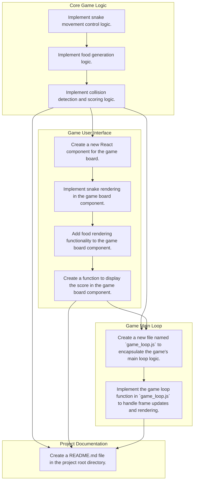

# KAIZEN Plan & DAG Execution Flow

## Overview
- **Deliverables Count**: 4
- **Tasks Count**: 10

## DAG Dependency Diagram

## Deliverables and Task Details

Deliverable: `Core Game Logic` (`coreLogic-a6ae79`)
- Kind: `core_logic`
- Goal: Implement the core mechanics of the Snake game, including movement, collision detection, and scoring.
- Priority: `1`
- Deliverable Dependencies: `None`
- Tasks: 
1. **Implement snake movement control logic.** (`coreLogic-a6ae79-t1-2c4dbb`)
- Output: `A function `moveSnake(direction)` in `snake.js` that updates the snake's position based on user input (up, down, left, right).`
- Completion Criteria: The snake moves correctly when arrow keys are pressed and does not move off the screen boundaries.
- Task Dependencies: `None`
2. **Implement food generation logic.** (`coreLogic-a6ae79-t2-dedd9d`)
- Output: `A function `generateFood()` in `game.js` that randomly places food on the game board.`
- Completion Criteria: Food appears at a random position on the board each time it is consumed by the snake.
- Task Dependencies: `coreLogic-a6ae79-t1-2c4dbb`
3. **Implement collision detection and scoring logic.** (`coreLogic-a6ae79-t3-944761`)
- Output: `Functions `checkCollision()` and `updateScore()` in `game.js` that handle collisions with walls and self, respectively, and update the score accordingly.`
- Completion Criteria: The game detects collisions with walls and the snake's own body, and the score is updated correctly when food is consumed.
- Task Dependencies: `coreLogic-a6ae79-t2-dedd9d`

Deliverable: `Game User Interface` (`gameUi-0ff351`)
- Kind: `ui`
- Goal: Create a user interface for the Snake game, including rendering the game board and displaying the score.
- Priority: `1`
- Deliverable Dependencies: `coreLogic-a6ae79`
- Tasks: 
1. **Create a new React component for the game board.** (`gameUi-0ff351-t1-50d335`)
- Output: `A new React component file named `GameBoard.js` containing the game board rendering logic.`
- Completion Criteria: The component should render a grid representing the game board and include placeholders for snake, food, and score display.
- Task Dependencies: `coreLogic-a6ae79-t3-944761`
2. **Implement snake rendering in the game board component.** (`gameUi-0ff351-t2-dd85d6`)
- Output: `Updated `GameBoard.js` with functions to render the snake on the game board.`
- Completion Criteria: The snake should be represented as a series of grid cells that can move around the board.
- Task Dependencies: `gameUi-0ff351-t1-50d335`
3. **Add food rendering functionality to the game board component.** (`gameUi-0ff351-t3-59a347`)
- Output: `Updated `GameBoard.js` with functions to randomly place food on the game board.`
- Completion Criteria: Food should appear as a single grid cell that can be eaten by the snake.
- Task Dependencies: `gameUi-0ff351-t2-dd85d6`
4. **Create a function to display the score in the game board component.** (`gameUi-0ff351-t4-827141`)
- Output: `Updated `GameBoard.js` with functions to update and render the score on the game board.`
- Completion Criteria: The score should be displayed prominently on the game board, updating as the snake eats food.
- Task Dependencies: `gameUi-0ff351-t3-59a347`

Deliverable: `Game Main Loop` (`mainLoop-735ece`)
- Kind: `core_logic`
- Goal: Implement the main loop that updates the game state and renders the UI at a consistent frame rate.
- Priority: `1`
- Deliverable Dependencies: `coreLogic-a6ae79, gameUi-0ff351`
- Tasks: 
1. **Create a new file named `game_loop.js` to encapsulate the game's main loop logic.** (`mainLoop-735ece-t1-a6c466`)
- Output: `A source file `game_loop.js` containing the main loop implementation.`
- Completion Criteria: The file should be present in the project directory with at least one function that initializes and runs the game loop.
- Task Dependencies: `coreLogic-a6ae79-t3-944761, gameUi-0ff351-t4-827141`
2. **Implement the game loop function in `game_loop.js` to handle frame updates and rendering.** (`mainLoop-735ece-t2-e536c7`)
- Output: `A functional `gameLoop` function within `game_loop.js` that updates game state, detects collisions, updates scores, and renders the UI.`
- Completion Criteria: The `gameLoop` function should be tested with a simple test case to ensure it runs at the expected frame rate and performs all required tasks.
- Task Dependencies: `mainLoop-735ece-t1-a6c466`

Deliverable: `Project Documentation` (`readme-48bd61`)
- Kind: `readme`
- Goal: Provide documentation for setting up and running the Snake game, including installation instructions and usage guidelines.
- Priority: `5`
- Deliverable Dependencies: `coreLogic-a6ae79, gameUi-0ff351, mainLoop-735ece`
- Tasks: 
1. **Create a README.md file in the project root directory.** (`readme-48bd61-t1-dcee23`)
- Output: `A README.md file containing installation instructions and usage guidelines for the Snake game.`
- Completion Criteria: The README.md file should include sections for 'Installation', 'Running the Game', and 'Game Controls'. Each section should be clearly labeled and contain relevant information.
- Task Dependencies: `coreLogic-a6ae79-t3-944761, gameUi-0ff351-t4-827141, mainLoop-735ece-t2-e536c7`

Execution Schedule Table

| Priority | Task ID | Deliverable | Objective | Dependencies |

| 1 | `coreLogic-a6ae79-t1-2c4dbb` | Core Game Logic | Implement snake movement control logic. | `None` |
| 1 | `coreLogic-a6ae79-t2-dedd9d` | Core Game Logic | Implement food generation logic. | `coreLogic-a6ae79-t1-2c4dbb` |
| 1 | `coreLogic-a6ae79-t3-944761` | Core Game Logic | Implement collision detection and scoring logic. | `coreLogic-a6ae79-t2-dedd9d` |
| 1 | `gameUi-0ff351-t1-50d335` | Game User Interface | Create a new React component for the game board. | `coreLogic-a6ae79-t3-944761` |
| 1 | `gameUi-0ff351-t2-dd85d6` | Game User Interface | Implement snake rendering in the game board component. | `gameUi-0ff351-t1-50d335` |
| 1 | `gameUi-0ff351-t3-59a347` | Game User Interface | Add food rendering functionality to the game board component. | `gameUi-0ff351-t2-dd85d6` |
| 1 | `gameUi-0ff351-t4-827141` | Game User Interface | Create a function to display the score in the game board component. | `gameUi-0ff351-t3-59a347` |
| 1 | `mainLoop-735ece-t1-a6c466` | Game Main Loop | Create a new file named `game_loop.js` to encapsulate the game's main loop logic. | `coreLogic-a6ae79-t3-944761, gameUi-0ff351-t4-827141` |
| 1 | `mainLoop-735ece-t2-e536c7` | Game Main Loop | Implement the game loop function in `game_loop.js` to handle frame updates and rendering. | `mainLoop-735ece-t1-a6c466` |
| 5 | `readme-48bd61-t1-dcee23` | Project Documentation | Create a README.md file in the project root directory. | `coreLogic-a6ae79-t3-944761, gameUi-0ff351-t4-827141, mainLoop-735ece-t2-e536c7` |