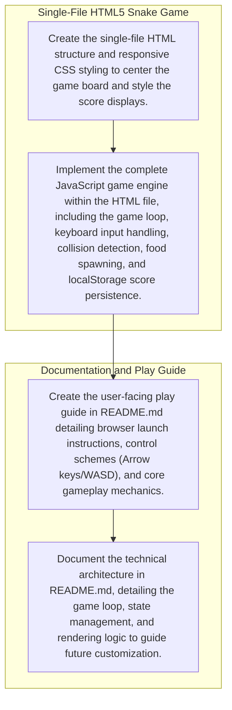

# KAIZEN Plan & DAG Execution Flow

## Overview
- **Deliverables Count**: 2
- **Tasks Count**: 4

## DAG Dependency Diagram

## Deliverables and Task Details

Deliverable: `Single-File HTML5 Snake Game` (`snakeGameHtml-a70390`)
- Kind: `source_code`
- Goal: A complete, self-contained HTML5 file containing the Canvas element, CSS styling, and JavaScript game loop for the Snake game.
- Priority: `1`
- Deliverable Dependencies: `None`
- Tasks: 
1. **Create the single-file HTML structure and responsive CSS styling to center the game board and style the score displays.** (`snakeGameHtml-a70390-t1-1613dd`)
- Output: `index.html containing the HTML skeleton, canvas element, score UI, and CSS styles.`
- Completion Criteria: Opening index.html in a browser displays a visually centered, responsive game container with a styled canvas and scoreboards.
- Task Dependencies: `None`
2. **Implement the complete JavaScript game engine within the HTML file, including the game loop, keyboard input handling, collision detection, food spawning, and localStorage score persistence.** (`snakeGameHtml-a70390-t2-c6ada0`)
- Output: `index.html updated with a script tag containing functions for init(), gameLoop(), update(), draw(), spawnFood(), handleInput(), and checkCollision().`
- Completion Criteria: The game is fully playable: the snake moves and responds to WASD/Arrow keys without self-reversal, grows when eating food, triggers game over on wall or self-collision, and saves the high score to localStorage.
- Task Dependencies: `snakeGameHtml-a70390-t1-1613dd`

Deliverable: `Documentation and Play Guide` (`readme-50e9cf`)
- Kind: `readme`
- Goal: Provide clear instructions on how to run the game, control schemes, and an overview of the code architecture.
- Priority: `5`
- Deliverable Dependencies: `snakeGameHtml-a70390`
- Tasks: 
1. **Create the user-facing play guide in README.md detailing browser launch instructions, control schemes (Arrow keys/WASD), and core gameplay mechanics.** (`readme-50e9cf-t1-e33fb1`)
- Output: `README.md file containing the 'How to Play' and 'Controls' sections.`
- Completion Criteria: Verify that README.md exists and clearly explains how to open the game in a browser without external dependencies, along with a complete breakdown of WASD/Arrow controls and game rules.
- Task Dependencies: `snakeGameHtml-a70390-t2-c6ada0`
2. **Document the technical architecture in README.md, detailing the game loop, state management, and rendering logic to guide future customization.** (`readme-50e9cf-t2-88cd1c`)
- Output: `README.md file updated with an 'Architecture and Customization' section.`
- Completion Criteria: Verify that the README.md contains a structured overview of the game's codebase, explaining how the game loop updates state and how the rendering engine draws the frames.
- Task Dependencies: `readme-50e9cf-t1-e33fb1`

Execution Schedule Table

| Priority | Task ID | Deliverable | Objective | Dependencies |

| 1 | `snakeGameHtml-a70390-t1-1613dd` | Single-File HTML5 Snake Game | Create the single-file HTML structure and responsive CSS styling to center the game board and style the score displays. | `None` |
| 1 | `snakeGameHtml-a70390-t2-c6ada0` | Single-File HTML5 Snake Game | Implement the complete JavaScript game engine within the HTML file, including the game loop, keyboard input handling, collision detection, food spawning, and localStorage score persistence. | `snakeGameHtml-a70390-t1-1613dd` |
| 5 | `readme-50e9cf-t1-e33fb1` | Documentation and Play Guide | Create the user-facing play guide in README.md detailing browser launch instructions, control schemes (Arrow keys/WASD), and core gameplay mechanics. | `snakeGameHtml-a70390-t2-c6ada0` |
| 5 | `readme-50e9cf-t2-88cd1c` | Documentation and Play Guide | Document the technical architecture in README.md, detailing the game loop, state management, and rendering logic to guide future customization. | `readme-50e9cf-t1-e33fb1` |