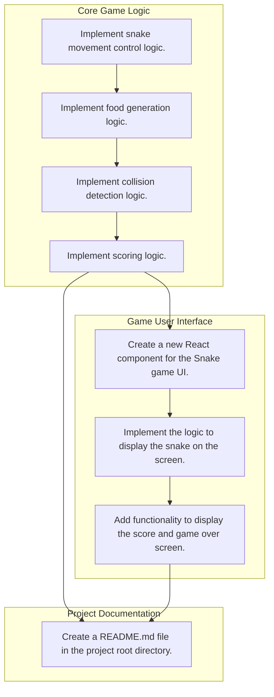

# KAIZEN Plan & DAG Execution Flow

## Overview
- **Deliverables Count**: 3
- **Tasks Count**: 8

## DAG Dependency Diagram

## Deliverables and Task Details

Deliverable: `Core Game Logic` (`coreLogic-5083b1`)
- Kind: `core_logic`
- Goal: Implement the core logic for the Snake game, including movement, collision detection, and scoring.
- Priority: `1`
- Deliverable Dependencies: `None`
- Tasks: 
1. **Implement snake movement control logic.** (`coreLogic-5083b1-t1-9f6dc3`)
- Output: `A function `moveSnake(direction)` in `snake_logic.js` that updates the snake's position based on user input or automatic movement.`
- Completion Criteria: The snake moves correctly in all four directions (up, down, left, right) and stops when it collides with walls.
- Task Dependencies: `None`
2. **Implement food generation logic.** (`coreLogic-5083b1-t2-b15221`)
- Output: `A function `generateFood()` in `game_logic.js` that randomly places food on the game board.`
- Completion Criteria: Food appears at a random position on the board, and it does not overlap with the snake.
- Task Dependencies: `coreLogic-5083b1-t1-9f6dc3`
3. **Implement collision detection logic.** (`coreLogic-5083b1-t3-686b0b`)
- Output: `A function `checkCollisions()` in `collision_logic.js` that detects collisions between the snake and walls or itself.`
- Completion Criteria: The game correctly identifies when the snake collides with the wall or itself, triggering appropriate actions.
- Task Dependencies: `coreLogic-5083b1-t2-b15221`
4. **Implement scoring logic.** (`coreLogic-5083b1-t4-b835bc`)
- Output: `A function `updateScore()` in `score_logic.js` that increments the score when the snake consumes food.`
- Completion Criteria: The score increases by a predefined amount each time the snake eats food, and it resets to zero when the game ends.
- Task Dependencies: `coreLogic-5083b1-t3-686b0b`

Deliverable: `Game User Interface` (`gameUi-832f05`)
- Kind: `ui`
- Goal: Create a user interface for the Snake game using a suitable framework.
- Priority: `1`
- Deliverable Dependencies: `coreLogic-5083b1`
- Tasks: 
1. **Create a new React component for the Snake game UI.** (`gameUi-832f05-t1-88f00f`)
- Output: `A new React component file named `SnakeGameUI.js` in the `src/components` directory.`
- Completion Criteria: The component should render the snake, score, and game over screen.
- Task Dependencies: `coreLogic-5083b1-t4-b835bc`
2. **Implement the logic to display the snake on the screen.** (`gameUi-832f05-t2-7dead7`)
- Output: `Updated code within the `SnakeGameUI.js` file to include rendering of the snake's segments.`
- Completion Criteria: The snake should be visible on the screen as a series of connected segments.
- Task Dependencies: `gameUi-832f05-t1-88f00f`
3. **Add functionality to display the score and game over screen.** (`gameUi-832f05-t3-ec02a2`)
- Output: `Updated code within the `SnakeGameUI.js` file to include rendering of the score and game over message.`
- Completion Criteria: The score should be displayed at the top of the screen, and the game over screen should appear when the game ends.
- Task Dependencies: `gameUi-832f05-t2-7dead7`

Deliverable: `Project Documentation` (`readme-c307e9`)
- Kind: `readme`
- Goal: Provide documentation for setting up and running the Snake game.
- Priority: `5`
- Deliverable Dependencies: `coreLogic-5083b1, gameUi-832f05`
- Tasks: 
1. **Create a README.md file in the project root directory.** (`readme-c307e9-t1-77c810`)
- Output: `A README.md file containing installation instructions, running the game, and controls.`
- Completion Criteria: The README.md file should be present in the project root directory with the specified content.
- Task Dependencies: `coreLogic-5083b1-t4-b835bc, gameUi-832f05-t3-ec02a2`

Execution Schedule Table

| Priority | Task ID | Deliverable | Objective | Dependencies |

| 1 | `coreLogic-5083b1-t1-9f6dc3` | Core Game Logic | Implement snake movement control logic. | `None` |
| 1 | `coreLogic-5083b1-t2-b15221` | Core Game Logic | Implement food generation logic. | `coreLogic-5083b1-t1-9f6dc3` |
| 1 | `coreLogic-5083b1-t3-686b0b` | Core Game Logic | Implement collision detection logic. | `coreLogic-5083b1-t2-b15221` |
| 1 | `coreLogic-5083b1-t4-b835bc` | Core Game Logic | Implement scoring logic. | `coreLogic-5083b1-t3-686b0b` |
| 1 | `gameUi-832f05-t1-88f00f` | Game User Interface | Create a new React component for the Snake game UI. | `coreLogic-5083b1-t4-b835bc` |
| 1 | `gameUi-832f05-t2-7dead7` | Game User Interface | Implement the logic to display the snake on the screen. | `gameUi-832f05-t1-88f00f` |
| 1 | `gameUi-832f05-t3-ec02a2` | Game User Interface | Add functionality to display the score and game over screen. | `gameUi-832f05-t2-7dead7` |
| 5 | `readme-c307e9-t1-77c810` | Project Documentation | Create a README.md file in the project root directory. | `coreLogic-5083b1-t4-b835bc, gameUi-832f05-t3-ec02a2` |